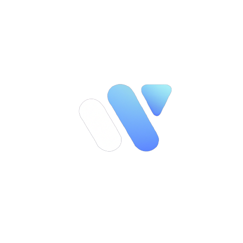

<a name="readme-top"></a>

<!-- PROJECT LOGO -->
<br />
<div align="center">
  <a href="https://github.com/Stijn-Rutten/Kwetter">
    
  </a>

<h3 align="center">Kwetter</h3>

  <p align="center">
    A Simple Twitter clone using Domain Driven Design, Blazor and .NET Maui
    <br />
    <br />
    <br />
    <!-- <a href="https://github.com/Stijn-Rutten/Kwetter">View Demo</a> -->
    <a href="https://github.com/Stijn-Rutten/Kwetter/issues">Report Bug</a>
    ·
    <a href="https://github.com/Stijn-Rutten/Kwetter/issues">Request Feature</a>
  </p>
</div>

<!-- TABLE OF CONTENTS -->
<details>
  <summary>Table of Contents</summary>
  <ol>
    <li>
      <a href="#about-the-project">About The Project</a>
      <ul>
        <li><a href="#built-with">Built With</a></li>
      </ul>
    </li>
    <li>
      <a href="#getting-started">Getting Started</a>
      <ul>
        <li><a href="#prerequisites">Prerequisites</a></li>
        <li><a href="#installation">Installation</a></li>
      </ul>
    </li>
    <li><a href="#usage">Usage</a></li>
    <li><a href="#roadmap">Roadmap</a></li>
    <li><a href="#contributing">Contributing</a></li>
    <li><a href="#license">License</a></li>
    <li><a href="#contact">Contact</a></li>
    <li><a href="#acknowledgments">Acknowledgments</a></li>
  </ol>
</details>

<!-- ABOUT THE PROJECT -->

## About The Project

[![Product Name Screen Shot][product-screenshot]](https://example.com)

Kwetter is a Twitter clone built with .NET 7, Asp.NET Core, and Domain Driven Design (DDD) principles. It allows users to create an account, post short messages (known as "kweets"), follow other users, and view a timeline of their own and their followed users' kweets.

<p align="right">(<a href="#readme-top">back to top</a>)</p>

### Built With

- .NET 7
- ASP.NET Core
- Entity Framework Core
- Blazor WASM
- Hybrid Maui

<p align="right">(<a href="#readme-top">back to top</a>)</p>

<!-- GETTING STARTED -->

## Getting Started

This is an example of how you may give instructions on setting up your project locally.
To get a local copy up and running follow these simple example steps.

### Prerequisites

This is an example of how to list things you need to use the software and how to install them.

- [.NET 7.x SDK](https://dotnet.microsoft.com/en-us/download)
- SQL Server

### Installation

1. Clone the repository to your local machine
   ```sh
   git clone https://github.com/Stijn-Rutten/Kwetter.git
   ```
2. Navigate to the Kwetter Directory
   ```sh
   cd Kwetter
   ```
3. Restore Nuget Packages
   ```js
   dotnet restore
   ```

<p align="right">(<a href="#readme-top">back to top</a>)</p>

<!-- CONTRIBUTING -->

## Contributing

No thanks 🙂

<!-- LICENSE -->

## License

Distributed under the MIT License. See `LICENSE.txt` for more information.

<p align="right">(<a href="#readme-top">back to top</a>)</p>

<!-- CONTACT -->

## Contact

Project Link: [https://github.com/Stijn-Rutten/Kwetter](https://github.com/Stijn-Rutten/Kwetter)

<p align="right">(<a href="#readme-top">back to top</a>)</p>
